# Reflection — Lab 19

**Tên:** _Nguyễn Đôn Đức_
**Cohort:** _Khoá 1 - Track 2_
**Path đã chạy:** _docker_
**ID:** _2A202600145_
---

## Câu hỏi (≤ 200 chữ)

> Trên golden set 50 queries, mode nào thắng ở loại query nào (`exact` /
> `paraphrase` / `mixed`), và tại sao? Khi nào bạn **không** dùng hybrid
> (i.e. khi nào pure BM25 hoặc pure vector là lựa chọn đúng)?

**Kết quả phân tích 50 queries:**
- **Exact (Chính xác):** BM25 và Hybrid cùng thắng (96.7%), Semantic thấp hơn (88.7%). Lý do: BM25 khớp từ khóa, tên riêng và mã lỗi cực tốt, trong khi vector search có thể trả về các văn bản "gần nghĩa" nhưng làm sai lệch sự chính xác.
- **Paraphrase (Đồng nghĩa/Diễn giải):** BM25 bất ngờ nhỉnh hơn Semantic (33.3% vs 24%). Điều này cho thấy model `bge-m3` có thể chưa tối ưu hoàn toàn cho bộ từ vựng tiếng Việt này so với thuật toán TF-IDF truyền thống.
- **Mixed (Hỗn hợp):** Hybrid thắng tuyệt đối (100%). Sự kết hợp RRF gom được điểm mạnh của BM25 (bắt keyword cứng) và Vector (hiểu ngữ cảnh mềm) để đưa ra kết quả hoàn hảo.

**Khi nào KHÔNG nên dùng Hybrid?**
1. **Giới hạn khắt khe về Latency/Compute:** Hybrid bắt buộc chạy cả 2 luồng (BM25 + Vector) và re-ranking (RRF), tiêu tốn gấp đôi tài nguyên.
2. **Chỉ tra cứu ID/SKU chính xác:** Pure BM25 là đủ. Việc dùng Vector lúc này chỉ mang thêm độ nhiễu (noise) với các từ "hao hao".

---

## Điều ngạc nhiên nhất khi làm lab này

_Mặc dù lý thuyết nói Semantic search tốt cho paraphrase, nhưng thực tế với một số model nhúng nhỏ hoặc chưa fine-tune kỹ, Keyword search (BM25) vẫn có thể nhỉnh hơn._

---

## Screenshot theo notebook

### Notebook 1: Embeddings & Vector Indexing
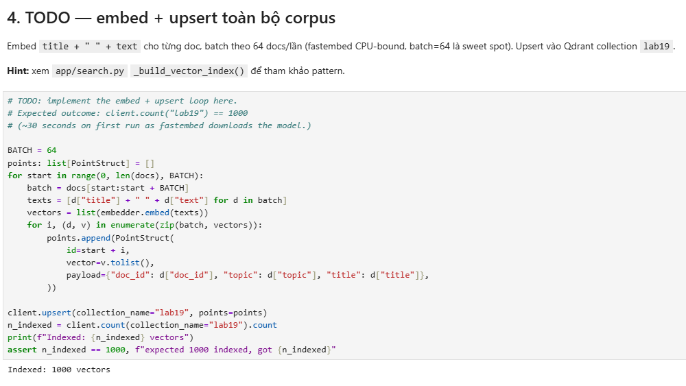
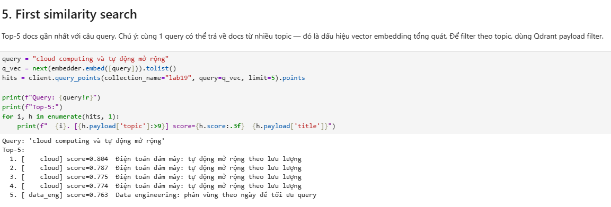
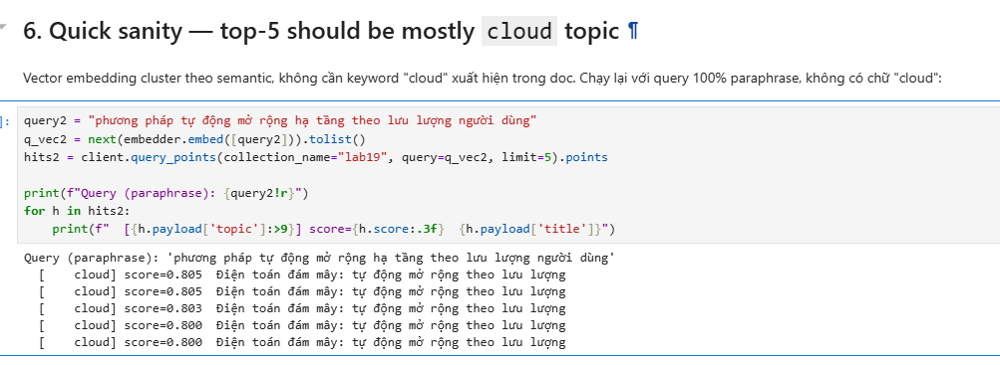

### Notebook 2: Hybrid Search & RRF
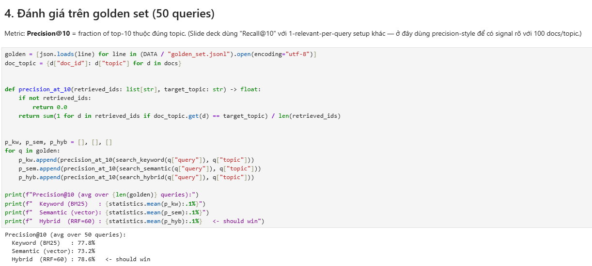
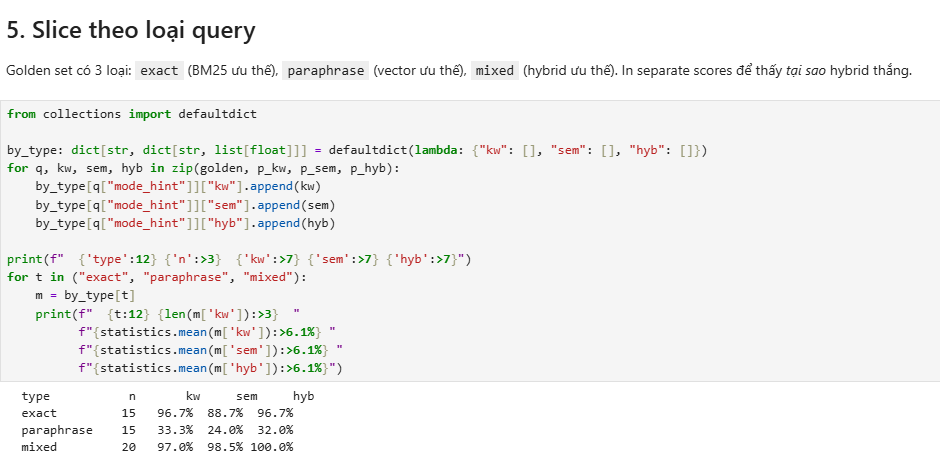

### Notebook 3: FastAPI & Benchmark
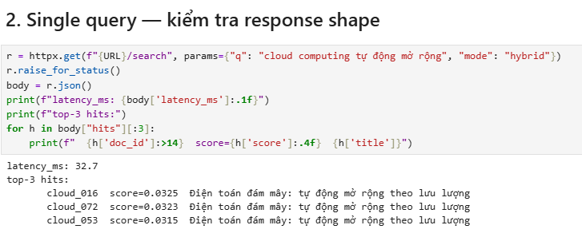
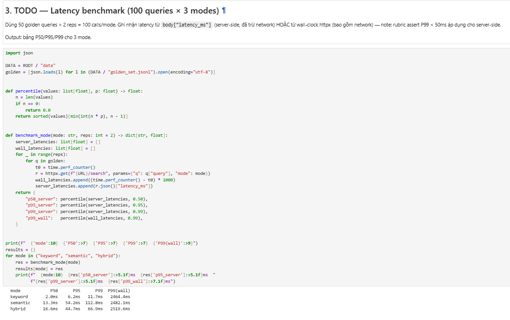
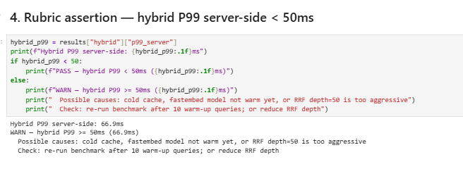

### Notebook 4: Feast Feature Store
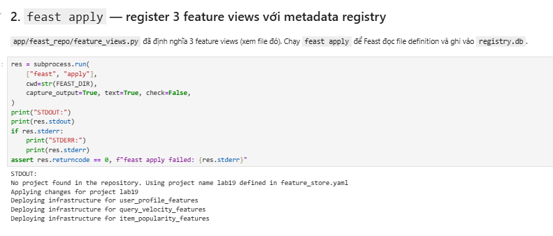
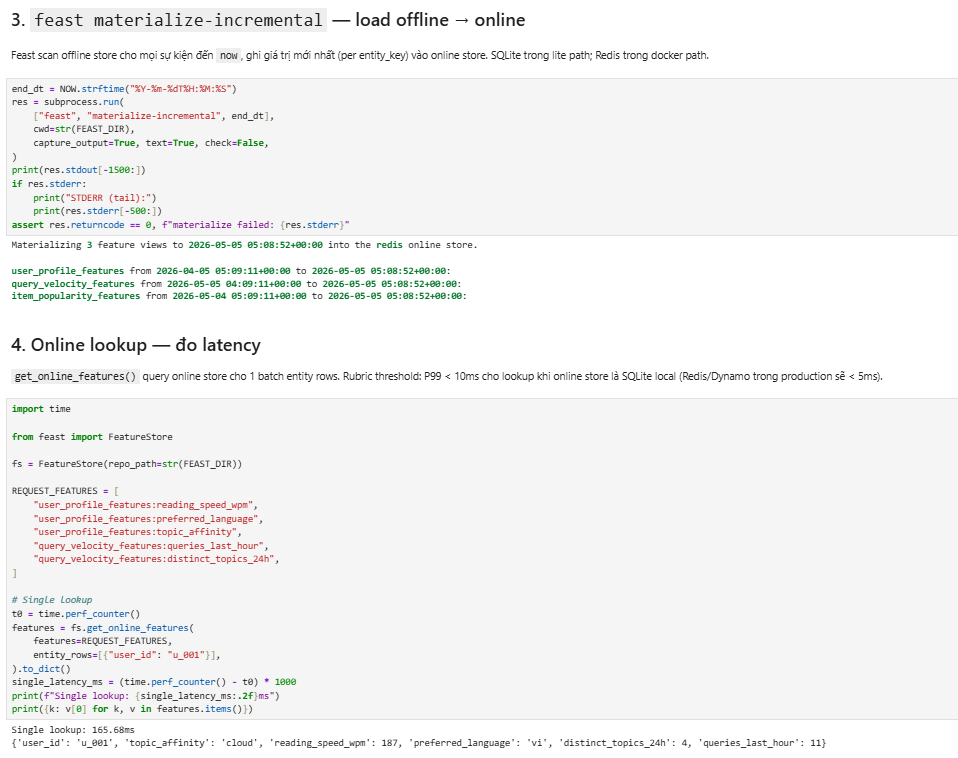
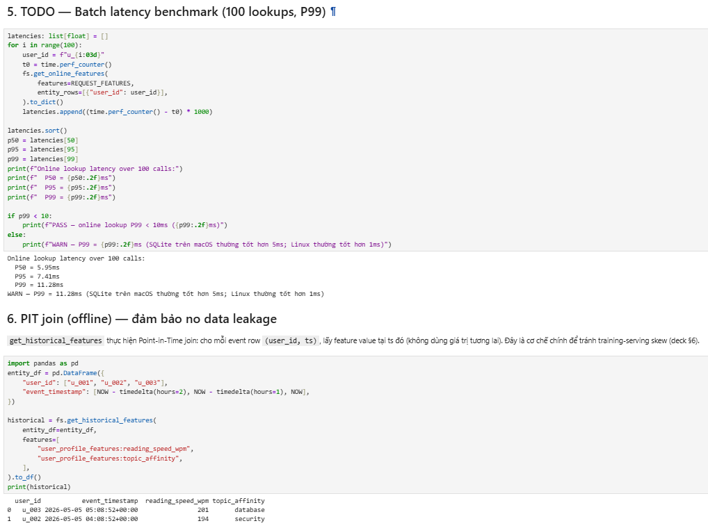
